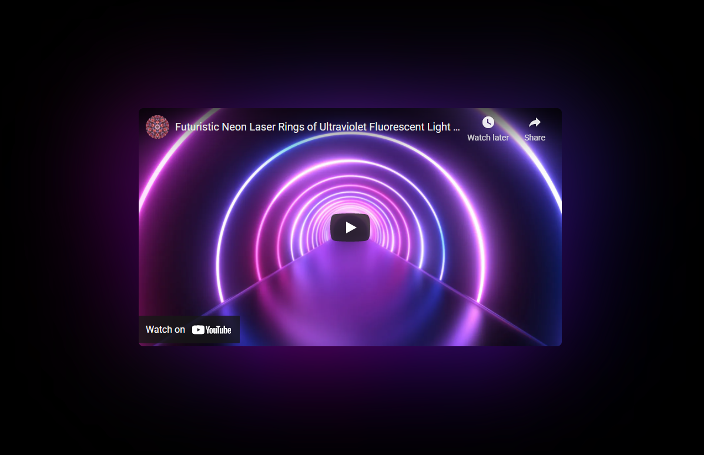

# React Ambilight Project 🌈✨

<p align="center">
  <a href="https://brunos3d.github.io/video-ambilight/">
    
  </a>
</p>

## 📖 About the Project

This project provides a **React component for creating Ambilight effects** with YouTube videos or HTML video elements. It also includes different demos and an example of the component integration in various environments like plain HTML and Next.js.

## 📂 Project Structure

The project is organized into the following directories:

- **`demo/`**: Contains demo projects showcasing the use of the Ambilight component in different environments.
  - **`canvas/`**: A demo using a simple HTML5 `<canvas>` element.
  - **`images/`**: Contains images used in the demos.
  - **`nextjs/`**: A demo for integrating the component in a Next.js project.
  - **`youtube/`**: A demo for integrating the component with YouTube videos.
- **`packages/`**: Contains the `react-ambilight` component package for NPM distribution.
  - **`react-ambilight/`**: The React component package. This can be published to NPM and used in any React project.
  - It also includes configuration files for building and distributing the package.
- **`LICENSE`**: The project's license file.

## 🚀 Getting Started

To get started with the `react-ambilight` component, you can install it via npm using the following command:

```bash
npm install react-ambilight
```

Please refer to the [package README](./packages/react-ambilight/README.md) for detailed installation and usage instructions.

## 📄 License

This project is licensed under the MIT License. See the [LICENSE](LICENSE) file for details.

---

💻 **Made with love by [Bruno](https://github.com/brunos3d)**
