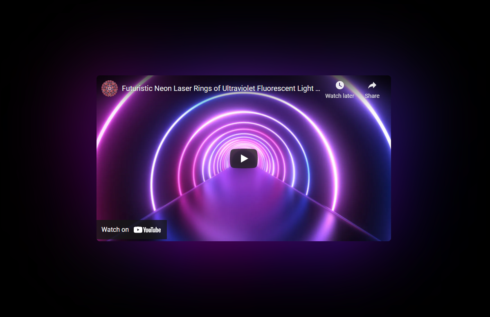

# videoglow

Ambilight style glow behind video, canvas and YouTube content, built as a
small family of npm packages with a framework-agnostic core.

<p align="center">
  <a href="https://videoglow.brunosilva.io/">
    
  </a>
</p>

Live examples and documentation: https://videoglow.brunosilva.io

## How it works

A frame source (a `<video>`, a canvas, an image) is sampled into a small canvas
placed behind the source. CSS `filter: blur()` on that canvas produces the glow
on the compositor, so no pixels are ever read back into JavaScript and the
effect works on cross-origin media without CORS headers. Video sources are
sampled through `requestVideoFrameCallback` and capped at 30 fps by default.

YouTube iframes cannot be sampled (the browser never exposes cross-origin
iframe pixels), so the YouTube package runs a second, muted player under the
same CSS and keeps it aligned with the visible one through an explicit
synchronization policy.

## Packages

| Package                                                | Purpose                                                                  | Depends on     |
| ------------------------------------------------------ | ------------------------------------------------------------------------ | -------------- |
| [`@videoglow/core`](./packages/core)                   | Engine: frame sources, frame clock, canvas glow renderer, glow style     | nothing        |
| [`@videoglow/video`](./packages/video)                 | `HTMLVideoElement` frame source                                          | core           |
| [`@videoglow/canvas`](./packages/canvas)               | Canvas, `OffscreenCanvas`, `ImageBitmap` and image frame sources         | core           |
| [`@videoglow/youtube`](./packages/youtube)             | YouTube IFrame API loader, typed player controller, playback coordinator | core           |
| [`@videoglow/react`](./packages/react)                 | `Ambilight` component, `useAmbilight`, `useFrameSource`                  | core, react    |
| [`@videoglow/react-video`](./packages/react-video)     | `VideoAmbilight` component, `useVideoSource`                             | react, video   |
| [`@videoglow/react-youtube`](./packages/react-youtube) | `YouTubeAmbilight` component, `useYouTubeAmbilight`                      | react, youtube |
| [`react-ambilight`](./packages/react-ambilight)        | Compatibility wrapper with the 1.x API                                   | react-youtube  |

Dependency direction is always towards the core. Framework packages never leak
into source packages.

## Installation

Pick the package for your use case. Every package ships ESM and CommonJS builds
with declarations.

Native `<video>` in React:

```bash
# npm
npm install @videoglow/react-video

# pnpm
pnpm add @videoglow/react-video

# yarn
yarn add @videoglow/react-video

# bun
bun add @videoglow/react-video
```

YouTube in React:

```bash
# npm
npm install @videoglow/react-youtube

# pnpm
pnpm add @videoglow/react-youtube

# yarn
yarn add @videoglow/react-youtube

# bun
bun add @videoglow/react-youtube
```

A canvas you draw yourself, in React:

```bash
# npm
npm install @videoglow/react @videoglow/canvas

# pnpm
pnpm add @videoglow/react @videoglow/canvas

# yarn
yarn add @videoglow/react @videoglow/canvas

# bun
bun add @videoglow/react @videoglow/canvas
```

No React, engine and video source only:

```bash
# npm
npm install @videoglow/core @videoglow/video

# pnpm
pnpm add @videoglow/core @videoglow/video

# yarn
yarn add @videoglow/core @videoglow/video

# bun
bun add @videoglow/core @videoglow/video
```

React 18.2 and 19 are supported. The packages ship ESM and CommonJS builds
with declarations.

## React: native video

```tsx
'use client'
import { VideoAmbilight } from '@videoglow/react-video'

export function Player() {
  return <VideoAmbilight src="/clip.webm" controls muted loop autoPlay playsInline blur={80} />
}
```

All video attributes are forwarded to the `<video>` element. The `ref` points
at the video, `ambilightRef` receives the engine instance.

## React: your own markup

```tsx
'use client'
import { useState } from 'react'
import { useAmbilight, useFrameSource } from '@videoglow/react'
import { createVideoSource } from '@videoglow/video'

export function Figure() {
  const [figure, setFigure] = useState<HTMLElement | null>(null)
  const [source, videoRef] = useFrameSource((video: HTMLVideoElement) => createVideoSource(video))
  useAmbilight({ container: figure, source, blur: 60 })
  return (
    <figure ref={setFigure}>
      <video ref={videoRef} src="/clip.webm" controls muted loop />
    </figure>
  )
}
```

## React: canvas

```tsx
'use client'
import { createCanvasSource } from '@videoglow/canvas'
import { Ambilight, useFrameSource } from '@videoglow/react'

export function Visualizer() {
  const [source, ref] = useFrameSource((el: HTMLCanvasElement) =>
    createCanvasSource(el, { mode: 'continuous' })
  )
  return (
    <Ambilight source={source} blur={70}>
      <canvas ref={ref} width={640} height={360} />
    </Ambilight>
  )
}
```

Use `mode: 'manual'` and call `source.invalidate()` after drawing when the
canvas does not animate continuously.

## React: YouTube

```tsx
'use client'
import { YouTubeAmbilight } from '@videoglow/react-youtube'

export function Player() {
  return (
    <YouTubeAmbilight
      videoId="I5QDO6BsWnU"
      glow={{ blur: 80, opacity: 0.5, saturation: 3 }}
      sync={{ driftToleranceSeconds: 0.25, checkIntervalMs: 1000 }}
    />
  )
}
```

## Without React

```ts
import { createAmbilight } from '@videoglow/core'
import { createVideoSource } from '@videoglow/video'

const video = document.querySelector('video')!
const source = createVideoSource(video)
const ambilight = createAmbilight({ container: video.parentElement!, source, blur: 80 })

ambilight.update({ blur: 40 })
ambilight.getState() // frames rendered, buffer size, timings
ambilight.dispose()
source.dispose()
```

The engine mounts a canvas as the first child of the container and makes the
container a positioned, isolated stacking context. The source element stays in
normal flow and paints above the glow.

## Next.js

The React packages are client components: every entry point starts with
`'use client'`, and no module touches browser globals at import time. Import
them from a client component in the App Router:

```tsx
// app/player.tsx
'use client'
import { VideoAmbilight } from '@videoglow/react-video'

export function Player() {
  return <VideoAmbilight src="/clip.webm" muted loop autoPlay playsInline />
}
```

```tsx
// app/page.tsx (server component)
import { Player } from './player'

export default function Page() {
  return <Player />
}
```

`apps/examples` in this repository is a complete Next.js 16 App Router
application built this way. It is deployed at https://videoglow.brunosilva.io.

## Configuration

| Option               | Default | Effect                                          |
| -------------------- | ------- | ----------------------------------------------- |
| `blur`               | 80      | CSS blur radius in px                           |
| `opacity`            | 0.5     | Glow layer opacity                              |
| `saturation`         | 3       | Saturation multiplier                           |
| `brightness`         | 1       | Brightness multiplier                           |
| `scale`              | 1.15    | How far the glow spills past the source box     |
| `fps`                | 30      | Sampling cap; 0 removes the cap                 |
| `resolution`         | 160     | Long edge of the internal buffer in px          |
| `pauseWhenHidden`    | true    | Stop sampling in hidden tabs                    |
| `pauseWhenOffscreen` | true    | Stop sampling when the glow leaves the viewport |

Style options are CSS on the glow layer and cost nothing per frame. `fps` and
`resolution` bound the per-frame draw cost.

## Performance

The only main-thread work per frame is one `drawImage` into a small buffer
(160x90 by default). On a laptop iGPU that takes well under 0.1 ms. The blur
runs on the compositor when the layer changes. The `/performance` page in the
examples app runs a benchmark across buffer sizes on your device.

YouTube synchronization issues one `postMessage` round trip per drift check
(once per second while playing) plus one call per leader state change. There
is no per-frame work.

## Browser support and limitations

- `requestVideoFrameCallback`: Chrome 83, Edge 83, Safari 15.4, Firefox 132.
  Older browsers fall back to `requestAnimationFrame` polling automatically.
- Cross-origin video without CORS works for the glow. Reading the glow's
  pixels yourself (`getImageData`) needs `crossorigin="anonymous"` and CORS
  headers on the media.
- YouTube: pixels cannot be read from the iframe. The second player downloads
  the stream a second time. Quality cannot be lowered through the API
  (`setPlaybackQuality` has been a no-op since 2019).
- Safari does not fire `requestVideoFrameCallback` for DRM streams; the video
  source detects this and falls back after one second.

## Repository

Nx monorepo managed with pnpm.

```bash
pnpm install
pnpm build            # all packages
pnpm test             # unit tests (Vitest)
pnpm lint
pnpm typecheck
pnpm dev              # examples app on http://localhost:3000
pnpm storybook        # Storybook on http://localhost:6006 (also served at /storybook on the site)
pnpm e2e              # Playwright against the built examples app
pnpm graph            # Nx project graph
```

Documentation:

- [Architecture](./docs/architecture/architecture.md)
- [Discovery of the original implementation](./docs/architecture/discovery.md)
- [Browser and YouTube API research](./docs/architecture/browser-research.md)
- [Package naming](./docs/architecture/package-naming.md)
- [Migration from react-ambilight 1.x](./docs/architecture/migration.md)
- [Live examples](https://videoglow.brunosilva.io)
- [Deployment to Vercel](./docs/deployment.md)
- [Releasing](./docs/releasing.md)
- [Contributing](./CONTRIBUTING.md)

## License

MIT. See [LICENSE](./LICENSE).
