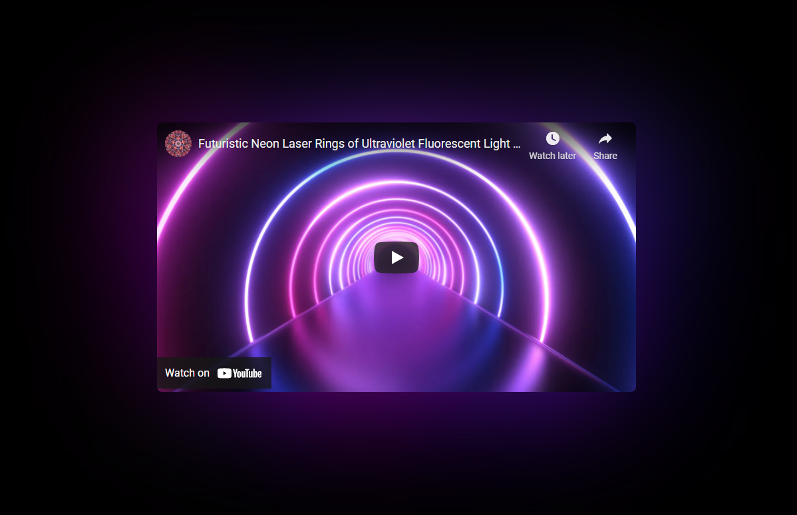

# Video Ambilight 🌈💻✨

<p align="center">
  <a href="https://brunos3d.github.io/react-ambilight/">
    
  </a>
</p>

## 📖 About the Project

**Video Ambilight** is a demo showcasing an ambilight effect inspired by the video player presented at the Next.js Conf 11. This project uses HTML5, JavaScript, CSS, and React to create a dynamic ambient lighting effect based on video content.

## 🚀 Live Demo

Check out the demos directly through the links below:

- **[YouTube iframe](https://brunos3d.github.io/react-ambilight/youtube/index.html)**: Integration with YouTube's API using HTML and CSS.
- **[Video + Canvas](https://brunos3d.github.io/react-ambilight/canvas/index.html)**: Implementation using `video` and `canvas`.
- **[React/Next.js](https://brunos3d.github.io/react-ambilight/nextjs/)**: Implementation with React and Next.js.

👉 **[Full Preview](https://brunos3d.github.io/react-ambilight/)**

---

## ✨ Examples in the Project

1. **YouTube iframe**  
   Path: `react-ambilight/youtube/`  
   An example using pure HTML, CSS, and the YouTube API (`iframe_api`).

2. **Video + Canvas**  
   Path: `react-ambilight/canvas/`  
   Implementation using a `video` element and `canvas` manipulation.

3. **Next.js/React**  
   Path: `react-ambilight/nextjs/src/components/VideoAmbilight/index.tsx`  
   A reusable ambilight component built with React and Next.js.

---

## 🛠️ Technologies Used

- **HTML5**
- **CSS3**
- **JavaScript (ES6+)**
- **React** and **Next.js**
- **Canvas API**
- **YouTube Player API**

---

## 💡 How to Use

1. Clone the repository:

   ```bash
   git clone https://github.com/brunos3d/react-ambilight.git
   cd react-ambilight
   ```

2. Access the desired example:

   - **HTML/CSS/YouTube**: Open the `index.html` file in your browser.
   - **Canvas/Video**: Navigate to `canvas/index.html`.
   - **React/Next.js**: Run the project:
     ```bash
     cd nextjs
     npm install
     npm run dev
     ```

3. Open your browser at [http://localhost:3000](http://localhost:3000) (for React/Next.js).

---

## 📄 React Component: `VideoAmbilight`

The React component is located at:  
`nextjs/src/components/VideoAmbilight/index.tsx`

### How It Works

- Synchronizes two YouTube players: one for display and one for the ambilight effect.
- Uses `requestAnimationFrame` for smooth rendering of the effect.
- Automatically adjusts the ambilight video quality for better performance.

### Usage

```tsx
import VideoAmbilight from './components/VideoAmbilight';

export default function App() {
  return <VideoAmbilight videoId="your-video-id" />;
}
```

---

## 🎥 Visual Preview

<p align="center">
  
</p>

---

## 📌 Important Notes

- This project **is not an NPM package**. To use the components, copy and paste the files into your project.
- Explore the provided examples to understand how to adapt the ambilight effect to your context.

---

## 🖋 Examples on CodePen

- **[YouTube iframe](https://codepen.io/brunos3d/pen/WNjLEGR)**
- **[Video + Canvas](https://codepen.io/brunos3d/pen/ExWMaYx)**

---

Contributions are welcome! 😊
